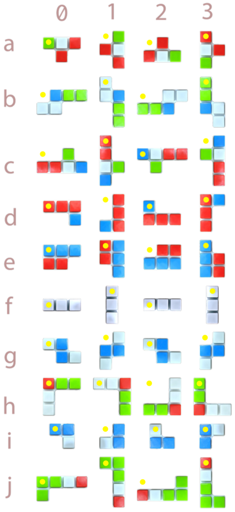

## Problem Description

The assignment involves implementing in Java, a board game called [IQ-focus](https://www.smartgames.eu/uk/one-player-games/iq-focus)
made by the games developer [SmartGames](https://www.smartgames.eu/uk).

#### Objective 

The game is a puzzle.  At the start, the player selects a
[challenge](#challenges) which defines the color of each of the nine
squares in the central board area.  The objective is to place all ten
colored playing pieces onto a board comprising 43 locations (indents).
The player must place the pieces such that they: a) fit together
correctly on the board, without overlaps or gaps, and b) satisfy the
challenge.

A completed game:

To help you visualize the game, we have provided a
[paper](assets/papergame.pdf) version, which you can cut out.

#### Challenges

A game starts by choosing a challenge which specifies the color of the
nine central squares.  Here is the chosen challenge for the game above
(this happens to be challenge 1 that comes with the game):

Interestingly, although all challenges are specified only in terms of
the arrangement of colors in the nine central squares, some challenges
are much easier to solve than others.  If you attempt the harder
tasks, you may want to reflect on what makes some challenges so much
easier than others.  Note that as a general rule for puzzles, the more
constrained the player is, the fewer options they have, and
consequently the solution to the challenge is simpler.

#### Solutions

Each challenge has just one solution.  When we refer to solutions, we
ignore piece rotations that take up the same space on the board.  Such
rotations are described as *symmetric*, which is defined in more
detail [below](#strict-symmetry).

The following sequence shows one possible progression of a solution to the game
above (note that the order in which the pieces are played is not important; this
is just one possible ordering).

#### Board

The game is played on a board comprised of 43 **locations** arranged
in a 9x5 grid.  In the real-world game, each location consists of a
square indent into which a piece may fit.  In our game, locations are
encoded as two digits, the first one identifying the column from `0`
to `8`, followed by another identifying the row from `0` to `4`.  For
example, in the game above, the first piece is put on position `30`
and the second is put on `32`.  Note that pieces are addressed as `XY`
where `X` identifies the column where the left-most square of the
piece is in, and `Y` identifies the row where the top square of the
piece is in.   Yellow dots in the diagram above indicate the
point of reference (i.e. the top-most row and left-most column
occupied by the piece).

#### Pieces

The game comprises **10 playing shapes**, each of which is made of
plastic and consists of three, four, or five connected squares (see
the photo above). The pieces fit neatly into the indents in the
plastic board formed by the 43 locations.

Each piece can be **rotated** at 90 degree increments, allowing for 4
different **orientations**.  The following illustration shows all 40
possible combinations of the 10 pieces and 4 orientations.   (Yellow
dots indicate the point of reference for the piece's location,
described below).

##### Strict Symmetry

Notice that piece `f` and piece `g` are symmetric, so rotating them
twice will not change the shape (for example `fxy0` is identical to
`fxy2`).  We describe that as *'strictly
[symmetric](https://en.wikipedia.org/wiki/Symmetry)'*.  We ignore the
redundant rotations with higher numberings (e.g. `fxy2`, `fxy3`,
`gxy2` and `gxy3` are ignored).

#### Legal Piece Placements

For a piece placement to be valid, the following must be true:

* All squares comprising each piece must be placed on valid board
  locations (**no part of a piece may be off the board**).
* All squares comprising each piece must be placed on vacant board
  locations (**pieces may not overlap**).

#### Encoding Game State and Challenge

Game states and challenges are encoded as strings.  Your game will
need to be able to initialize itself using these strings and some of
your tasks relate directly to these strings.

##### Challenge Strings

A challenge string consists of a sequence of exactly nine characters,
each describing the color of one square in the central 3x3 board area.
There are four colors: `White`, `Red`, `Blue` and `Green`, which are
encoded as `'W'`, `'R'`, `'B'` and `'G'` respectively.

For the sample challenge below, the challenge string is `"RRRBWBBRB"`,
which is achieved by tracing the central board area with this order:

##### Placement Strings

A placement string consists of between one and ten (inclusive) **piece
placements** (pieces `a` to `j`).  The placement string may not
include any piece twice.  A completed game must include ten piece
placements.  Each piece placement is described using four characters.
For example, the game described above is characterized (when complete)
by the string `"a000b013c113d302e323f400g420h522i613j701"`.  Note that
the placement string is ordered (piece `a` first, and piece `j` last),
which is a requirement for valid placement strings.

##### Piece Placement Strings

A piece placement string consists of four characters describing the
location and orientation of one particular piece on the board:

* The first character identifies **which of the ten shapes** is being
  placed (`a` to `j`).
* The second character identifies **which column** the left of the
  piece is in (columns are labelled `0` to `9`).
* The third character identifies **which row** the top of the piece is
  in (rows are labelled `0` to `4`).
* The fourth character identifies **which orientation** the piece is
  in (`0` to `3` for four rotations as illustrated above).

The image above shows the first and fourth characters for each of the
pieces in each of their orientations (40 in total). For example, at
top left, 'a0' describes piece 'a' at orientation '0'.  Below it, 'b0'
describes piece 'b' at orientation '0'.  At the bottom right 'j3'
describes piece 'j' at orientation '3'.  And so on.  A piece placement
string starts and ends with these two characters and has two more in
between which describe where the piece is placed.

